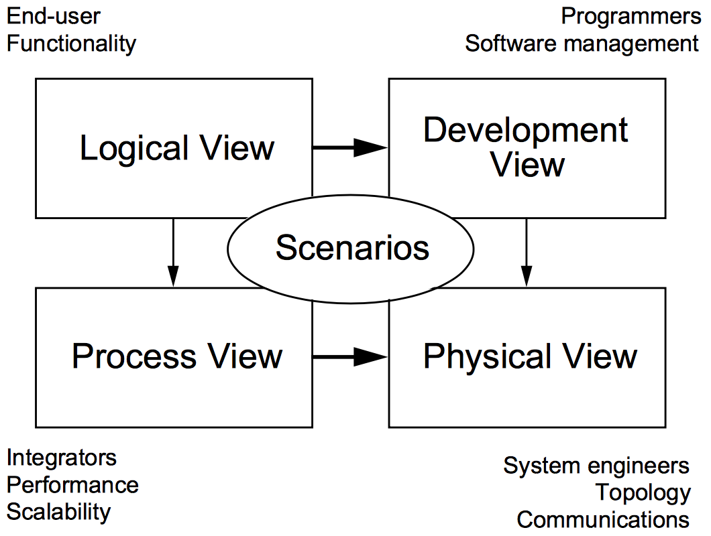

# Diseño de Aplicaciones 2

Este repositorio intenta ser una guía de estudio para la asignatura Diseño de Aplicaciones 2 de la carrera Ingeniería en Sistemas (Plan 2003) de la Universidad ORT Uruguay. **Es material NO oficial** hecho por la comunidad de alumnos y debe servir como apoyo al dictado y material oficial de la asignatura.

## Modelo 4 + 1

Es un modelo para "describir la arquitectura de sistemas de software, basado en el uso de múltiples vistas concurrentes". Las vistas suelen describir el sistema desde el punto de vista de diferentes interesados, tales como usuarios finales, desarrolladores o directores de proyecto. Las cuatro vistas del modelo son: vista lógica, vista de desarrollo, vista de proceso y vista física. Además, una selección de casos de uso o escenarios suele utilizarse para ilustrar la arquitectura sirviendo como una vista más.

### Vista lógica

Está enfocada en describir la estructura y funcionalidad del sistema. Los diagramas UML que se utilizan para representar esta vista son los Diagrama de Clase, Diagrama de Comunicación, Diagrama de Secuencia (Vistos en Diseño de Aplicaciones 1)

### Vista de desarrollo

Ilustra el sistema desde la perspectiva de un programador y está enfocada en la administración de los artefactos de software. Los diagramas UML que se utilizan para representar esta vista son el Diagrama de Componentes y el Diagrama de Paquetes.

### Vista de proceso

[Próxima clase]

## Bibliografía

1. [Architectural Blueprints - The “4+1” View Model of Software Architecture](http://www.cs.ubc.ca/~gregor/teaching/papers/4+1view-architecture.pdf) by Philippe Kruchten